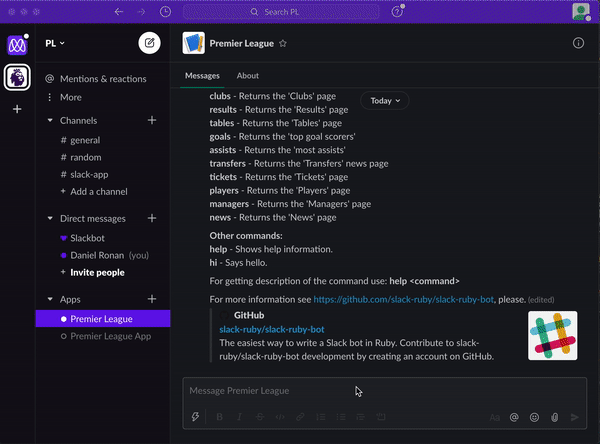

# Ruby Slack Bot 🤖


## Library Directory 📙
 
| Contents        |
| ------------- |
| [Built With](#built-with-🛠) |
| [Install](#install-⏳) |
| [Hints](#hints-💡) |
| [Testing](#testing-⚙️) |
| [Authors](#authors) | 
| [License](#license) | 

## Description
> This is my final project for completing the `Ruby` module. In doing so, I have created a `Slack Bot`.



In this Slack Bot, I have created it so you can interact, receive messages and information for what you desire. I have created an app that provides you with a broad range of information on an english football league, the `Premier League` ⚽

## Built With 🛠
```
- Ruby 2.6.3
- Slack
- VS Code
- Ruby Gems
```

   

## Install ⏳

> Follow these steps below to get my Application working

1. - [ ] Open your `Terminal`
2. - [ ] Navigate to the directory where you will like to install the repo by running `cd FOLDER-NAME`
3. - [ ] Run `git clone git@github.com:DcRonan/ruby-slack-bot.git` to download <b>or</b> you can download using `HTTPS` by running `git clone https://github.com/DcRonan/ruby-slack-bot.git` in the terminal
4. - [ ] Run `cd ruby-slack-bot` to enter directory
5. - [ ] Run `bundle install` to install Ruby Gems (<b>hint:</b> Mac users, if not working then run `sudo bundle install`)
6. - [ ] Create your own Slack [workspace](https://slack.com/create#email)
7. - [ ] Create your own [Bot](https://slack.com/services/new/bot)
8. - [ ] Give it a `username`, `name` and `logo` if you want
9. - [ ] Keep note of your `API Token` as shown in the example below:

10. - [ ] Click `Save Integration`
11. - [ ] Open a text editor, `VS Code` for an example
12. - [ ] Create a `.env` file
13. - [ ] In the `.env` file, copy and paste `SLACK_API_TOKEN= YOUR-TOKEN-HERE`
14. - [ ] Open Slack and in your new workspace, click the `+` on <b>Apps</b> to add your Bot
15. - [ ] Run `rackup` in your terminal to get your Bot working
16. - [ ] Type `help` in the Slack app to get started

> There are many commands that my app provides so please look below on how to access them

## Hints 💡

* Start a conversation by saying `hello` or `hey` : It will respond with different responses depending on the conversation
* Type `help` to show the list of commands
* Type `fixtures` for example and this will give you the link to all the upcoming Premier League fixtures 📆
* Invite your Bot to a channel mentioning their name `@bot name` and clicking `Invite to Channel`
* To use the commands in a channel, type `@bot name [command-name]`

## Testing ⚙️

> I have used [rspec](https://rspec.info/) testing tool to test the code by creating many test cases. Please follow below to test my code

1. - [ ] Open `Terminal` again
2. - [ ] Run `cd ruby-slack-bot` to enter directory
3. - [ ] Run `rspec` to start testing
4. - [ ] All tests will pass ✅


## Authors

### 👨‍💻 Daniel Ronan
[](https://github.com/DcRonan) <br>
[](https://www.linkedin.com/in/danronan10/) <br>
[](mailto:danielconnorronan@gmail.com) <br>
[](https://twitter.com/dc_ronan)

### 🤝 Contributing

Contributions, issues and feature requests are welcome!

Feel free to check the [issues page](https://github.com/DcRonan/ruby-slack-bot/issues).

### Show your support

Give a ⭐️ if you like this project!

### License


